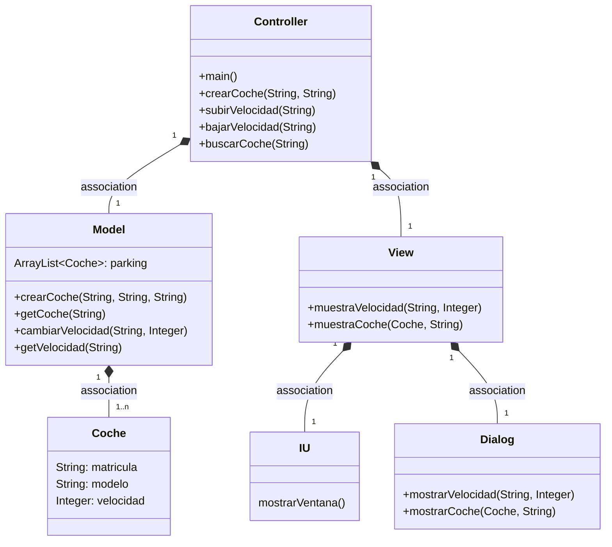
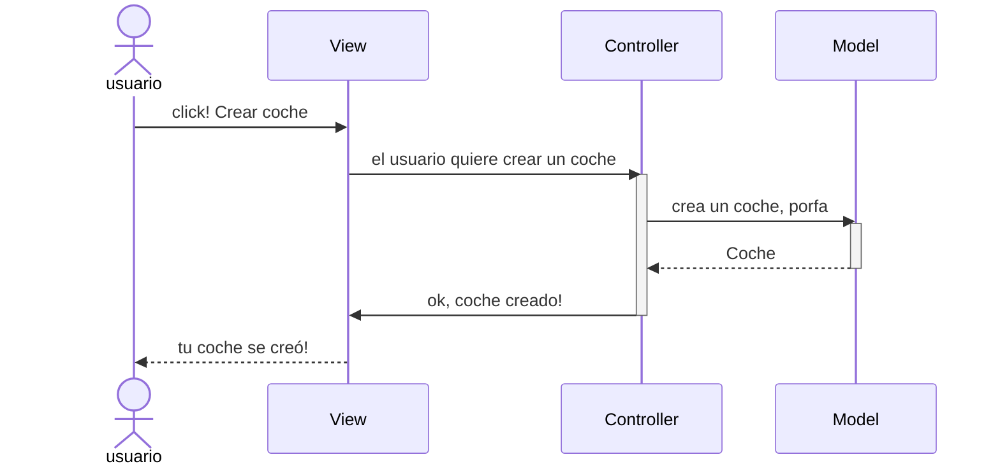
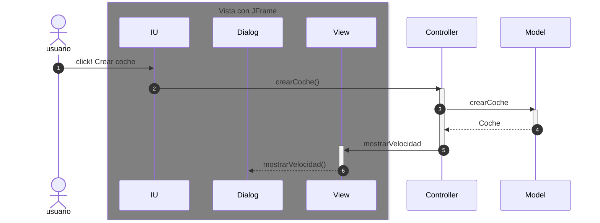
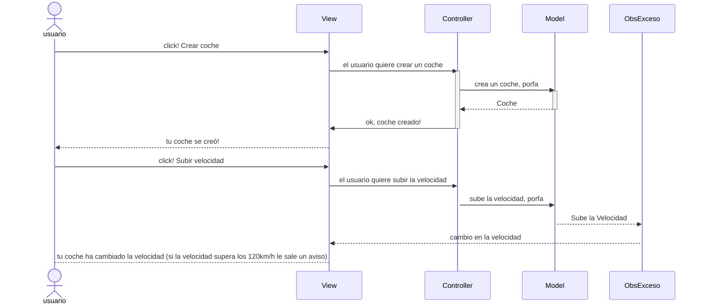
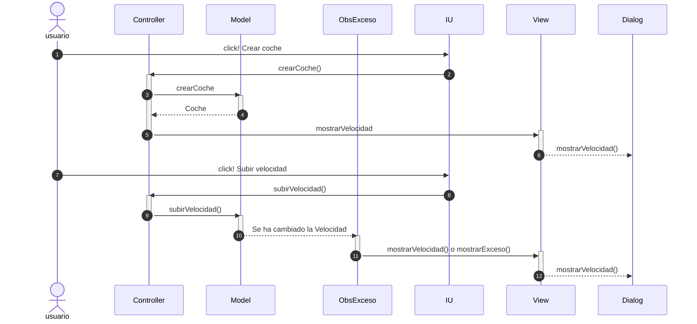

# Arquitectura MVC

Aplicación que trabaja con objetos coches, modifica la velocidad y la muestra, tambien con la posibilidad de mostrar el coche al completo

---

En esta rama está añadido los eventos en la IU

---
### Diagrama de clases:

---

## Evento en el View

Cuando ocurre un evento en la vista, el `controller` se tiene que enterar.
Tenemos que tener en cuenta que en el MVC estricto, la vista no se comunica con el modelo.

En el listener del botón llamamos al `controller` y este llama primero al `model` y al recibir los datos del model llama a la vista `view`.

Pasa lo mismo con los métodos subir velocidad, bajar velocidad y ver coche pero cambiando el texto por el respectivo de esos métodos.

Ahora la parte de la Arquitectura de la vista, son tres clases:

Aquí como en el otro esquema, con los otros métodos pasa exactamente lo mismo pero con las llamadas del respectivo método.

Cerrando el issue #1

En está rama hemos implementado la funcionalidad de buscar coches. Para esto hemos creado un método estático llamado buscarCoche, este recibe la matricula del coche del que queremos mostrar la información.

Este método recoge el coche en un auxiliar del método getCoche del model. Seguido de esto llama a la vista para mostrar el Coche.

En la vista he creado un método llamado muestraCoche que recibe el auxiliar de coche del controller y la matricula. Aquí se mira si el auxiliar es nulo, al ser así saca por el dialog un mensaje de que no existe el coche con tal matrícula. En caso de que si exista el coche muestra toda la información del coche a traves del dialog

---
## Pasos para crear el observer

1. Model
    * Extiende de `Observable`
    * En el método en donde ocurra el cambio (en este caso en subir y bajar velocidad):
        * setChenged()
        * notifyObserver(valor) -> en este caso: notifyObserver(getCoche(matricula))
2. Crear una clase que sea el observador, que implementa la interface `Observer` (ObsExceso en este ejemplo)
    * definir el método `update()`
3. Controller
    * Instanciar el observer, definido en el punto anterior
    * Añadir este observer al observable con `addObserver()`

---
## Evento en la Vista con el Observer
Este sería el diagrama de secuencias explicado de forma general

---
## Evento con Observer pero con los nombres de los métodos
De esta manera sería el diagrama de secuencias explicado de forma mas específica

